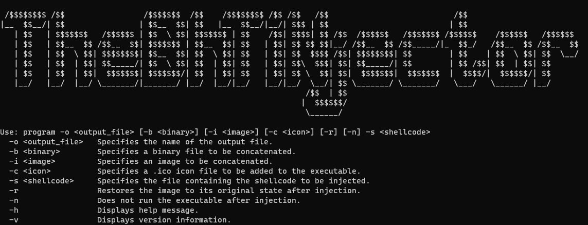
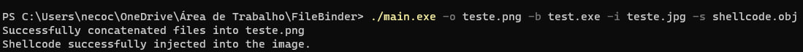
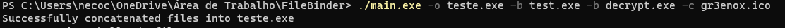

# TheBhTiNjector 
TheBhTiNjector is a file binder that concatenates files while preserving their functionality

[![Project Status: Active – The project has reached a stable, usable state and is being actively developed.]


## And how does it work?
Basically, it concatenates multiple types of files, which can be executables, images or executables with images, uniting them and having the possibility of injecting shellcode.

## What is shellcode?
The shortest definition is, a shellcode is a small piece of code used as a payload in exploiting a software vulnerability. And what does it mean? Shellcode is defined as a set of instructions injected and then executed by an exploit. Shellcode is used to directly manipulate the registries and functionality of an exploit, and can even secure a shell on the target machine. For the shellcode to work correctly, you need to pay attention to these aspects:

-- Shellcode Size: The shellcode size cannot exceed the available space in the image, resulting in improper injection.

-- Shellcode Format: The shellcode may not be formatted correctly to run on the target architecture. Make sure the shellcode is compatible with the architecture of the system where the image will run.

-- Poor Testing: If you are not seeing the expected behavior when opening the image, it is possible that your testing is incomplete or inadequate. Make sure you are testing in a suitable environment and that you are observing the results correctly.

## And how do I use it?
First you compile the shellcode (this may vary depending on your machine) for example: 

```nasm -f elf32 -o shellcode.o shellcodeWin.asm```
   ```ld -m elf_i386 -o shellcode shellcode.o```

Then, you compile the main code with your preferred compiler, in this case I will use G++ for example: ```g++ -o main.exe main.cpp```

After you compile, you can run for example: ```./main.exe -h``` which will give you all the options of what to do and how to do it.


## running the script
After that, you can concatenate the files and inject the shellcode, as in this example:


You can also concatenate binary with binary, as in this example:


## How do I contribute to this project?
To contribute to this project you need to make a pull request, and then give us a detailed description of what you want to add or change and we at the black hell team will review the code and authorize it, sometimes editing the implementation a little to maintain good programming practices.

## License
[MIT](https://github.com/Black-Hell-Team/TheBhTiNjector/blob/main/LICENSE)
