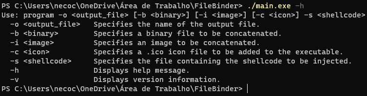

# TheBhTiNjector
TheBhTiNjector is a file binder that concatenates files while preserving their functionality

## And how does it work?
Basically, it concatenates multiple types of files, which can be executables, images or executables with images, uniting them and having the possibility of injecting shellcode.

## And how do I use it?
First you compile the shellcode (this may vary depending on your machine) for example: ```nasm -f elf32 -o shellcode.o shellcodeWin.asm
                                                                                          ld -m elf_i386 -o shellcode shellcode.o```
Then, you compile the main code with your preferred compiler, in this case I will use G++ for example: ```g++ -o main.exe main.cpp```
After you compile, you can run for example: ```./main.exe -h``` which will give you all the options of what to do and how to do it.

